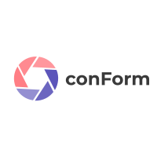

</a>

## About conForm

For optimal planning and realization of a project or a task, it is necessary to prepare an overview in advance  of what the project should roughly look  like later. Such a form is called a concept paper. It contains the most important elements of the planned project, meaning a description, the necessary/nice-to-have functions, the technologies used and the team. To facilitate the creation and editing of such a document within the team, this project deals with the implementation of a web application, which enables exactly these functions without any problems.

**conForm** is a program that allows the user to create, edit and save multiple concept papers. In order to use the full range of functions, the user must first create an account and log in. Once a document is created, he can invite his team to the lobby using a join code and each participant can make changes and save them. This also works without registration, but in this case the download as PDF and DOCX document is only possible with Watermark. The application also allows  to add an own logo directly, which has already been created in advance. Otherwise the conForm logo is used by default.

In addition, a Kanban board has been implemented to improve the flow of teamwork. This allows the user to divide the task and the requirements into sub-items and to monitor the work progress.

In summary, the application is a useful tool to make the joint work of several participants on a project as simple and efficient as possible.

## How to get started

You can find our Setup Guide in the [Setup Guide](https://github.com/BeckmannArmin/laravel-conForm/wiki) to build and deploy it yourself.

If there are any problems you can try to fix it with the help of our [Troubleshooting](https://github.com/BeckmannArmin/laravel-conForm/wiki/Troubleshoot)

## More

In our [Wiki - Section]() you can find all further information about the project. 

## Contributors

- Armin Beckmann
- Noah Semar
